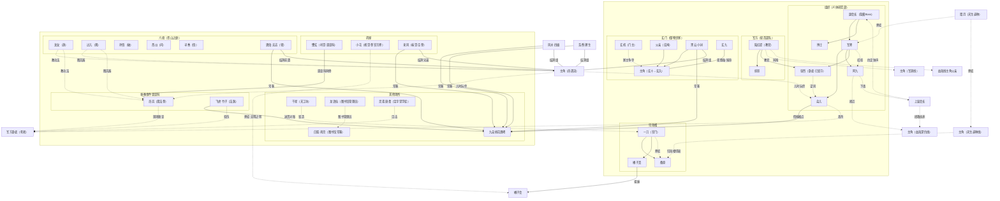

# 角色关系图

> 更新日期: 2026-07-21
> 关联文档：`docs/character-relations.md` — 角色关联矩阵 | `docs/character-stories.md` — 角色背景小故事

```mermaid
graph TB
  %% ===== Left Column: 组织 + 军方 + 归海楼 + 玄门 =====
  subgraph Left[" "]
    direction TB
    subgraph Org["组织（义体研究部）"]
      direction TB
      vp["副会长（隐藏Boss）"] --> js["军师"]
      vp --> bs["博士"]
      js --> de["朵儿"]
      js --> aj["阿九"]
      js --> zl["张烈（卧底·已变节）"]
    end

    subgraph Mil["军方（斩首部队）"]
      direction TB
      lht["陆红提（教官）"] --> ly["掠影"]
      lht --> zl
    end

    subgraph GHL["归海楼"]
      direction TB
      yd["一刀（掌门）"] --> sy["桑原"]
      yd --> jzz["橘子真"]
    end

    subgraph XM["玄门（御物世家）"]
      direction TB
      xj["玄机（门主）"]
      fq["父亲（玄柌）"]
      hys["黑云·小树"]
      xj9["玄九"]
      xm_z["主角（玄十→玄久）"]
      xj -.->|家主争夺| xm_z
      fq --> xm_z
      hys --> xm_z
      xj9 ---|双胞胎·殒命| xm_z
    end
  end

  %% ===== Right Column: 药屋 + 六绝 + 调查科 + 其他 =====
  subgraph Right[" "]
    direction TB
    subgraph Yao["药屋"]
      direction TB
      dx["黛玄（听觉·调查科）"]
      xh["小花（视觉·拳掌宗师）"]
      lf["来风（味觉·空拳）"]
    end

    subgraph Lj["六绝（青山之巅）"]
      direction TB
      ln["龙女（逸）"]
      ge["过儿（观）"]
      sw["孙悟（破）"]
      xg["西瓜（闪）"]
      xx["寻香（悟）"]
      jg["酒鬼·无志（韧）"]
    end

    subgraph DCK["特殊事件调查科"]
      direction TB
      ql["奇岚（雷法拳）"]
      zz["飞虎·竹子（法医）"]
    end

    subgraph Other["其他场所"]
      direction TB
      qx["千星（天工坊）"]
      lyx["龙语仙（图书馆管理员）"]
      bh["白狐·南宫（图书馆常客）"]
      tr["灵素·唐柔（宝字堂学徒）"]
      jd["九朵桃花酒吧"]
    end
  end

  %% ===== 跨列连线 =====
  de -->|情报据点| jd
  jg -->|常客| jd
  lf -->|常客| jd
  fs["风水·四娘"] -->|常客| jd
  hr["浩然·潮生"] -->|常客| jd
  hys -->|常客| jd
  zz -->|送货对账| jd

  yd -.->|师徒| sy
  lyue["腊月（天生道种）"] -.->|师徒| sect_z["主角（天生道种线）"]
  lyue -.->|师徒| js
  ge -.->|赠兵器| wander_z["主角（奇遇流）"]
  ln -.->|教功法| wander_z
  ge -.->|赠兵器| ql
  ln -.->|教功法| ql
  lht -.->|教官| vet_z["主角（军旅线）"]
  lht -.->|同袍| feud_f["血海线主角父亲"]
  xh -.->|师徒·无明之明| jzh["橘子会"]
  jzz -->|姐妹| jzh

  lf ---|结拜兄弟| wander_z
  jg ---|结拜前置| wander_z
  fs ---|结拜组| wander_z
  hr ---|结拜组| wander_z
  hys ---|结拜组| wander_z

  de -.->|毒杀| dead["军方卧底（死者）"]
  zz -.->|验伤| dead
  tr -.->|目击| dead
  ql -.->|现场勘查| dead

  js -.->|招揽| aj
  aj -.->|接近| feud_z["主角（血海深仇线）"]
  aj -.->|下毒| hz["上届会长"]
  zl -.->|望风| de

  dx ---|调查科同僚| ql
  lyx -.->|图书管理员| bh
  sect_z -.->|归海楼切磋| sy
  wander_z -.->|儿时玩伴| de
  wander_z -.->|儿时玩伴| ql
  hz -.->|搭救抚养| feud_z
  hz -.->|约定钟声| vp
  qx -.->|锻造| yd
```
