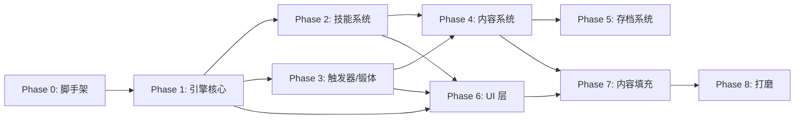

# 第 8 章：MVP 清单与开发路线图

---

## 8.1 总览

从零到可玩 MVP 的开发路线图。按依赖关系分阶段，每个阶段产出可测试的独立模块。



---

## 8.2 Phase 0 — 项目脚手架

**目标：** 能跑能测的空白工程

| 任务                     | 文件/产出                                         | 预估    |
| ------------------------ | ------------------------------------------------- | ------- |
| `npm create vite` 初始化 | `package.json`, `vite.config.ts`, `tsconfig.json` | 15min   |
| 安装依赖                 | react 19, zustand 5, vitest, eslint               | 10min   |
| 建立文件夹结构           | `src/engine/`, `src/bridge/`, `src/ui/` 等        | 15min   |
| 配置 ESLint + Vitest     | `.eslintrc`, `vitest.config.ts`                   | 15min   |
| 第一个测试               | `src/engine/__tests__/setup.test.ts` — 空测试通过 | 5min    |
| Git 初始化               | `git init`, `.gitignore`, 初始 commit             | 10min   |
| **合计**                 |                                                   | **~1h** |

**文件夹结构（来自 ch01）：**

```
src/
├── engine/           # 逻辑层，纯 TS，零外部依赖
│   ├── entities/     # Character, Skill, Action, Trigger
│   ├── systems/      # BattleEngine, TurnManager, EventQueue
│   ├── data/         # 静态数据表（选手/招式/功法）
│   ├── __tests__/
│   └── index.ts
├── bridge/           # 桥接层
│   ├── adapter.ts    # GameState → ReadonlyView
│   ├── dispatcher.ts # UI action → GameCommand
│   └── index.ts
├── ui/               # React UI 层
│   ├── screens/      # MainMenu, Preparation, Event, Shop, Battle, Result
│   ├── components/   # OptionCard, InfoPanel, DialoguePanel, LogPanel, Tooltip
│   ├── input/        # 键盘/鼠标/触屏适配
│   ├── store.ts      # Zustand UI store
│   └── index.tsx
├── main.tsx
└── vite-env.d.ts
```

---

## 8.3 Phase 1 — 引擎核心

**目标：** 纯逻辑层，可在 Node/测试中跑一场完整战斗

**依赖：** Phase 0

### 8.3.1 属性系统

```ts
// src/engine/entities/attributes.ts
type AttrName = 'strength' | 'vitality' | 'dexterity' | 'technique' | 'insight' | 'wisdom'

interface AttributeSet {
    get(attr: AttrName): number
    set(attr: AttrName, value: number): void
    modify(attr: AttrName, delta: number): void
    total(): number
}
```

| 任务                    | 测试点                        |
| ----------------------- | ----------------------------- |
| 属性容器 (AttributeSet) | get/set/modify, 取值范围 1-30 |
| HP 计算 `20 + vit × 10` | vit=10→120, vit=20→220        |
| 属性缩放公式            | `damage = Σ(scaling × attr)`  |

### 8.3.2 角色实体

```ts
interface Character {
    id: string
    name: string
    attrs: AttributeSet
    hp: number
    maxHp: number
    ap: number
    maxAp: number
    statuses: StatusEffect[]
}
```

| 任务            | 测试点                 |
| --------------- | ---------------------- |
| 角色创建        | 属性/HP/AP 正确初始化  |
| HP 增减与上下界 | 不超过 maxHp，不低于 0 |
| AP 消耗与恢复   | 回合开始恢复至 maxAp   |

### 8.3.3 距离系统

```ts
interface DistanceSystem {
    current: number // 0-6
    move(delta: number): void
    inRange(min: number, max: number): boolean
}
```

| 任务     | 测试点                       |
| -------- | ---------------------------- |
| 距离增减 | move ±1，边界 0-6            |
| 范围检测 | `inRange(2,4)` 正确判定      |
| 移动效率 | `AP × dex / 20` 计算移动档位 |

### 8.3.4 回合管理器

```ts
interface TurnManager {
    currentActor: Character
    turnOrder: Character[]
    next(): void
    modifyTurn(target: Character, deltaMs: number): void
}
```

| 任务            | 测试点         |
| --------------- | -------------- |
| 回合排序        | 按间隔时间排序 |
| 前摇/硬直       | 行动后插入延迟 |
| Stun/Slow/Haste | 时间修正正确   |

### 8.3.5 战斗引擎（最小闭环）

```ts
interface BattleEngine {
    state: BattleState
    execute(action: ActionCommand): BattleResult
    get log(): BattleLog
}
```

| 任务         | 测试点                     |
| ------------ | -------------------------- |
| 命中判定     | `technique` vs `dexterity` |
| 招架判定     | `strength` + 武器招架率    |
| 闪避判定     | `dexterity` 修正           |
| 伤害计算     | 属性缩放 × 距离系数 × 暴击 |
| 基础攻击循环 | 双方轮流动手，HP 归零结束  |

### 8.3.6 效果链系统

```ts
interface EffectChain {
    buckets: DamageBuckets // 基础×暴击×距离×效果链×特殊
    apply(chain: Effect[]): DamageResult
}
```

| 任务       | 测试点             |
| ---------- | ------------------ |
| 伤害桶串联 | 各修正系数正确乘算 |
| 效果链触发 | 按优先级依次触发   |

### 8.3.7 战斗日志

```ts
interface BattleLog {
    entries: LogEntry[]
    add(entry: LogEntry): void
    summarize(): string[]
}
```

| 任务     | 测试点           |
| -------- | ---------------- |
| 日志记录 | 每次行动写入一行 |
| 日志查询 | 按类型/回合过滤  |

**Phase 1 合计：~3-4 天**

---

## 8.4 Phase 2 — 技能系统

**目标：** 招式 + 功法可装备、可执行、主招队列 + 辅招触发

**依赖：** Phase 1

### 8.4.1 武器系统

**武器系统已于 Phase 1 中期重构为个体物品系统。**

武器不再是类别（WeaponType），而是个体物品，每把武器有独立属性。

所有可收集/可装备物品共享基类：

```ts
// src/engine/entities/base.ts
interface GameEntity {
    id: string
    name: string
    description: string
}
```

`WeaponDef`、`ActionDefinition`、`Passive`、`Artifact` 全部继承 `GameEntity`。
`ActionDefinition` 和 `Passive` 将新增 `description` 字段。

```ts
// src/engine/data/weapons.ts
export type WeaponTag = '劈砍' | '钝击' | '戳刺'

export interface WeaponDef extends GameEntity {
    tags: WeaponTag[]
    bound?: boolean
    attrMods: Partial<Record<AttrName, number>>
    parryRate: number
    range: [number, number]
}
```

**默认武器「赤手空拳」：**

```ts
{
    id: 'bare_hands',
    name: '赤手空拳',
    description: '什么都没有，但什么都有可能。',
    tags: ['钝击'],
    bound: true,
    attrMods: {},
    parryRate: 0,
    range: [0, 2],
}
```

无任何加成惩罚，开局默认装备，`bound: true`（不可替换）。

**关键改动：**

- 前后摇从武器剥离 → 统一 `BASE_PRE_DELAY=300` / `BASE_STUN_TIME=350`，受身法影响
- 招式使用 `requiredTags: WeaponTag[]`（空数组 = 无限制）代替 `weaponType`
- 部分招式有 `extraPreDelay` / `extraStunTime`（如炁弹 +100ms 前摇）
- 招式绑定标签：正拳→钝击、刺击→戳刺、横扫→劈砍、弹指/震脚→无限制
- 无背包，一人一把，更换时旧武器永久丢失
- `bound: true` 的武器不可更换

### 8.4.2 招式系统

```ts
interface ActionDefinition extends GameEntity {
    id: string
    name: string
    description: string
    actionCost: number
    bestDistance: number
    requiredTags: WeaponTag[] // 空数组 = 无限制
    effects: Effect[]
    extraPreDelay?: number
    extraStunTime?: number
    maxUses?: number
    bonus?: boolean
}
```

| 任务         | 测试点                                              |
| ------------ | --------------------------------------------------- |
| 招式数据结构 | 全部字段正常序列化                                  |
| 主招队列执行 | 按序检测 AP/距离/状态，第一个满足的执行             |
| 队列全不满足 | 跳过主招，AP 留给移动/辅招                          |
| 辅招触发     | `after_main` / `on_hit` / `turn_end` 等时机正确触发 |
| 辅招条件检测 | HP 阈值、距离、状态等条件判断正确                   |
| 限次消耗     | `maxUses` 耗尽后不可用                              |

### 8.4.3 功法系统

```ts
interface SkillDefinition {
    id: string
    name: string
    trigger: TriggerDefinition // 被动触发条件
    effects: Effect[]
}
```

| 任务       | 测试点             |
| ---------- | ------------------ |
| 被动触发   | 条件满足时自动执行 |
| 多功法叠加 | 互不冲突           |

### 8.4.4 MVP 招式清单（约 20 个）

| 系   | 招式                   | 工作量 |
| ---- | ---------------------- | ------ |
| 拳掌 | 正拳/崩拳/铁山靠/弹指  | 小     |
| 刀剑 | 横斩/居合/燕返         | 小     |
| 长枪 | 刺击/横扫千军/裂地击   | 中     |
| 暗器 | 飞针/毒镖/暴雨梨花     | 中     |
| 御物 | 御剑/御剑防御/御器冲击 | 大     |
| 通用 | 移动/防御/待机         | 小     |

**Phase 2 合计：~3-4 天**

---

## 8.5 Phase 3 — 触发器 + 锻体 + 远程技能

**目标：** 触发器系统（条件→消耗 AP→效果）、锻体（常态 buff + 战斗 buff）、
远程技能（御物/暗器/远程招式的事件机制）

**依赖：** Phase 1 + Phase 2

| 任务                 | 说明                                         | 预估      |
| -------------------- | -------------------------------------------- | --------- |
| 触发器系统           | 触发条件匹配、AP 消耗、效果执行、槽位限制    | 1.5d      |
| MVP 触发器清单       | ~8 个触发器（反击/洞察/灼烧反馈等）          | 1d        |
| 锻体系统             | 常态 buff（全局属性加成）+ 战斗 buff（炁技） | 1.5d      |
| 8 个炁技             | 凝炁/聚炁/破炁/愈炁/影炁/噬炁/速炁/炁弹      | 1d        |
| 远程/独立 event 机制 | 御物针、dot 时间轴事件                       | 1.5d      |
| 状态系统             | 灼烧/麻痹/失衡/中毒/眩晕 叠层+衰减           | 1d        |
| **合计**             |                                              | **~7.5d** |

> 义体 → 移入 Phase 7 内容填充。义体本质是奇物的一种（带部位惩罚的属性加成），
> 不需要独立系统支持，数据驱动即可。
> 御物·本命物 → 移入 Phase 7 内容填充。本命物本质也是奇物，
> 御物招式已在 Phase 2 MVP 招式清单中。
> | **合计** | | **~6.5d** |

---

## 8.6 Phase 4 — 内容系统

**目标：** 节点地图、事件、商店、对手生成、淘汰赛

**依赖：** Phase 1 + Phase 2

| 任务                  | 说明                              | 预估    |
| --------------------- | --------------------------------- | ------- |
| 节点地图生成          | 三阶段 + 3 选 1 + 权重偏向        | 1d      |
| 事件系统              | Event + Option 数据驱动，条件检测 | 1d      |
| 商店系统              | 商品列表、购买、金币管理          | 0.5d    |
| 对手生成              | 按轮次缩放 + 已解锁池             | 1d      |
| 淘汰赛对阵表          | 32 强随机打乱 + 胜者晋级          | 0.5d    |
| 隐藏 Boss（第 31 人） | 信物碎片收集 + 触发               | 1d      |
| **合计**              |                                   | **~5d** |

---

## 8.7 Phase 5 — 存档系统

**依赖：** Phase 4（需要有完整游戏状态）

| 任务                      | 预估       |
| ------------------------- | ---------- |
| GameState 序列化/反序列化 | 0.5d       |
| localStorage 读写         | 0.25d      |
| 自动存档（每节点）        | 0.25d      |
| 读取记录列表              | 0.25d      |
| **合计**                  | **~1.25d** |

---

## 8.8 Phase 6 — UI 层

**目标：** 可玩的图形界面

**依赖：** Phase 1-4 完成（逻辑完整），UI 本身依赖 React 19

### 8.8.1 公共组件

| 组件             | 说明                                          | 预估 |
| ---------------- | --------------------------------------------- | ---- |
| OptionCard       | 选卡（1-4），数字快捷键，disabled/hidden 状态 | 0.5d |
| OpponentCard     | 对手卡，属性条可视化                          | 0.5d |
| InfoPanel        | Tab 切换（属性/功法/招式/奇物/触发器）        | 1d   |
| Tooltip          | Hover/Focus 详情                              | 0.5d |
| DialoguePanel    | 滚动文本，可折叠                              | 0.5d |
| LogPanel（右栏） | 日志摘要，过滤器                              | 0.5d |

### 8.8.2 屏幕组件

| 屏幕         | 说明                           | 预估  |
| ------------ | ------------------------------ | ----- |
| MainMenu     | 标题 + 选项                    | 0.25d |
| Preparation  | 装备编辑 + 招式配置 + 打开匣子 | 1d    |
| EventScreen  | 叙事 + 选择 + 结果展示         | 0.5d  |
| ShopScreen   | 商品列表 + 购买                | 0.5d  |
| BattleScreen | Canvas + 战斗日志              | 2d    |
| ResultScreen | 胜利/失败 + 奖励悬浮           | 0.5d  |
| 节点选择     | 3 选 1 过渡                    | 0.5d  |
| 全屏日志     | L 键打开                       | 0.5d  |

### 8.8.3 Canvas 战斗可视化

| 任务                           | 预估  |
| ------------------------------ | ----- |
| 角色精灵绘制（站立/攻击/受击） | 1d    |
| 距离指示 + HP/AP 条            | 0.5d  |
| 伤害数字飘动                   | 0.5d  |
| 动作名称显示                   | 0.25d |
| 状态图标浮动                   | 0.5d  |

### 8.8.4 输入系统

| 任务                              | 预估  |
| --------------------------------- | ----- |
| 键盘 Tab 区域切换                 | 0.5d  |
| 快捷键注册 (1-4, H, L, `, Esc, ?) | 0.5d  |
| 鼠标 hover/click                  | 0.25d |
| 焦点指示器样式                    | 0.25d |

### 8.8.5 Zustand UI Store

| 任务                 | 预估 |
| -------------------- | ---- |
| Store 定义 + actions | 0.5d |
| Bridge 数据流贯通    | 0.5d |

**Phase 6 合计：~12 天**

---

## 8.9 Phase 7 — 内容填充

**依赖：** Phase 2-4 数据系统就绪

| 内容          | 数量            | 预估     |
| ------------- | --------------- | -------- |
| 32 强选手数据 | 32 个 × ~30min  | 3-4d     |
| 故事背景      | 10 个 × ~1h     | 2-3d     |
| 事件文本      | ~50 个 × ~20min | 2d       |
| 奇物          | ~20 个          | 1d       |
| 功法          | ~20 个          | 1d       |
| 招式          | ~20 个          | 1d       |
| 义体          | ~15 个          | 0.5d     |
| 触发平衡调整  | 全局            | 1d       |
| **合计**      |                 | **~13d** |

---

## 8.10 Phase 8 — 打磨

| 任务         | 说明                 | 预估    |
| ------------ | -------------------- | ------- |
| 数值平衡     | 调整属性缩放/伤害/HP | 2d      |
| 解锁链验证   | 确保无死锁           | 1d      |
| Bug 修复     | 边缘情况             | 3d      |
| 像素风格装饰 | CRT 扫描线、边框     | 1d      |
| 键盘体验优化 | 焦点流转流畅度       | 1d      |
| 战斗动画微调 | 动画时长、缓动       | 1d      |
| **合计**     |                      | **~9d** |

---

## 8.11 总量估算

| 阶段                          | 预估                  |
| ----------------------------- | --------------------- |
| Phase 0: 脚手架               | ~1h                   |
| Phase 1: 引擎核心             | ~3-4d                 |
| Phase 2: 技能系统             | ~3-4d                 |
| Phase 3: 触发器/锻体/远程技能 | ~7.5d                 |
| Phase 4: 内容系统             | ~5d                   |
| Phase 5: 存档                 | ~1.25d                |
| Phase 6: UI 层                | ~12d                  |
| Phase 7: 内容填充             | ~13d                  |
| Phase 8: 打磨                 | ~9d                   |
| **总计**                      | **~55d（约 3 个月）** |

### MVP 里程碑

```
M0 — Day 1:      命令行可跑一场基础战斗（Phase 1）
M1 — Week 2:     招式 + 功法可配置、可执行（Phase 2）
M2 — Week 3:     触发器 + 锻体 + 远程技能可用（Phase 3）
M3 — Week 4:     节点地图 + 事件 + 商店 + 淘汰赛（Phase 4）
M4 — Week 5:     基本 UI 可看可点（Phase 6 前半）
M5 — Week 6-7:   完整 UI + Canvas 战斗（Phase 6 后半）
M6 — Week 8-10:  内容填充 + 存档（Phase 5 + Phase 7）
M7 — Week 11-12: 打磨 + 平衡（Phase 8）
→ MVP 发布
```
